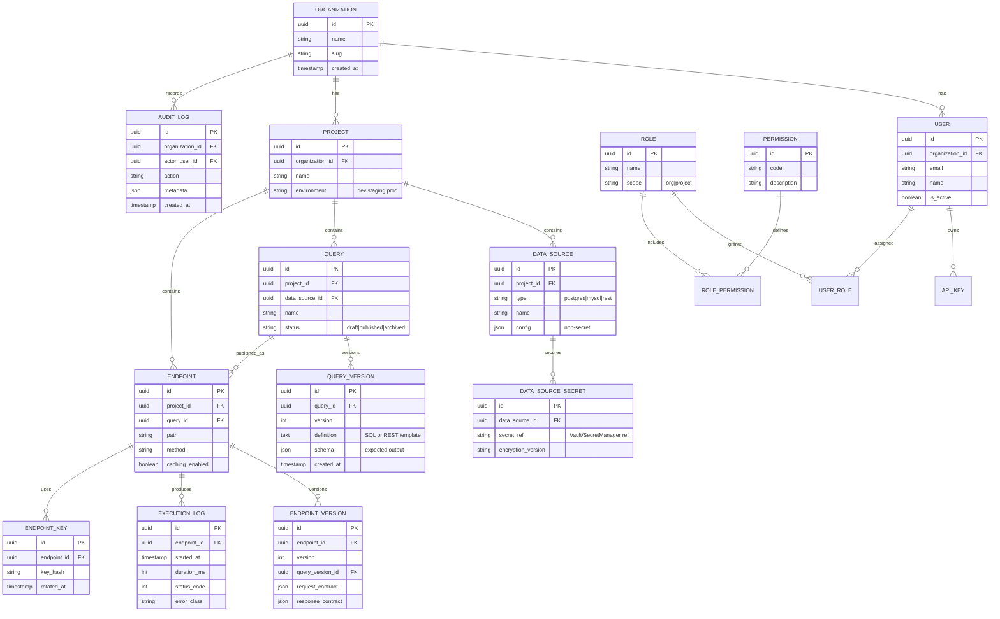
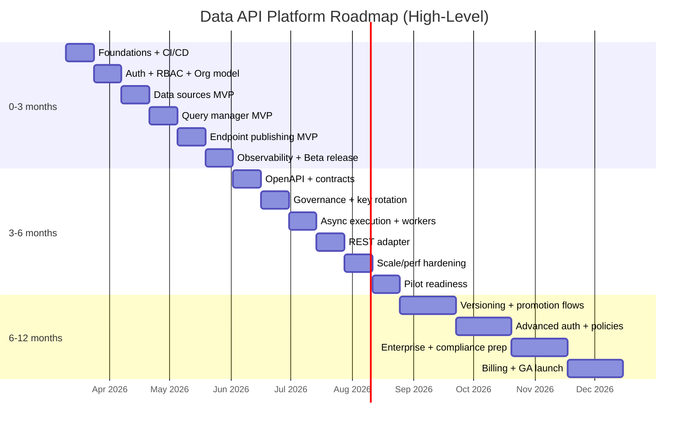

# Deep Research Report on the Unspecified App Idea  
Date: March 10, 2026 (Asia/Phnom_Penh)

## Executive summary  

The “app idea” is materially underspecified: there is no explicit problem statement, target user segment, platform scope (web vs iOS/Android), monetization model, compliance constraints, or scaling assumptions. Because of this, any build plan must start by documenting assumptions and designing a flexible architecture that can be adapted once requirements become concrete.

That said, the only artifact available in the conversation environment is a user-provided diagram file titled **“Data Lake”** (a tldraw JSON). Its visible text strongly suggests a **Data Platform / Data Lake** concept centered on: (a) connecting to multiple data sources (e.g., MySQL, PostgreSQL, REST APIs), (b) defining queries, and (c) publishing those queries as “user endpoints,” plus admin features like user management, roles/privileges, caching, and encryption-by-default. It also hints at a **Go + Fiber v3 + GORM** backend stack and containerized deployment via **Docker + Compose**. The plan below therefore treats “Data Lake” as the *most plausible interpretation* of the concept, while clearly labeling all additional implications as assumptions.

This report delivers a comprehensive build blueprint for a production-grade **Data API Platform**: a web dashboard for configuring data sources and queries, and a runtime layer that exposes those queries as secure HTTP endpoints with authentication, authorization, rate limiting, caching, logging, and observability. The design intentionally stays modular so it can be repurposed if the real idea turns out to be different.

Primary/official sources are used for recommended tools and standards, including Go releases and documentation (go.dev), Fiber docs, GORM docs, Docker Compose docs/spec, PostgreSQL and MySQL docs, Redis/Valkey docs, OpenTelemetry, Prometheus, Grafana, Sentry, GitHub Actions, Terraform, OpenAPI, JWT, OAuth 2.1 draft, OWASP guidance, and pricing pages for select managed services. citeturn0search0turn0search1turn0search2turn0search3turn1search2turn1search3turn1search1turn1search4turn5search0turn5search1turn5search2turn5search3turn4search0turn4search1turn9search0turn9search2turn9search3turn7search0turn7search1  

## Assumptions and unspecified items  

### What’s explicitly unspecified (must be confirmed later)  
Platform targets are unknown (web-only vs iOS/Android/web). Monetization is unknown (subscription, usage-based, freemium, enterprise licensing). Regulatory/compliance is unknown (e.g., GDPR, HIPAA, SOC 2, ISO 27001, financial rules). Data scale is unknown (number of sources, query volume, data size, latency needs, multi-region). Without these, architecture choices must support change without a rewrite.

### Working interpretation of the concept (assumption, derived from the “Data Lake” diagram)  
**Assumption:** The intended product is a **Data Platform** that allows teams to:

1) Register and manage multiple **data sources** (at least MySQL, PostgreSQL, and REST APIs).  
2) Define **queries** (SQL and/or REST transformations).  
3) Publish queries as **HTTP endpoints** (“User-Endpoints”).  
4) Provide a **Dashboard** plus **User Management**, **Roles & Privileges**, and **System Settings**.  
5) Implement **caching** (memory + Redis/Valkey) and **encryption by default** for secrets and sensitive data.  
6) Run containerized locally/deployed via **Docker + Compose**, with future scalability options.

### Architectural assumptions to make the plan actionable  
**Assumption (scope):** Web dashboard + API runtime is the primary deliverable; mobile apps are optional and likely unnecessary for an admin-heavy platform.

**Assumption (tenancy):** Multi-tenant SaaS (Organizations/Workspaces), where each org has its own data sources, queries, endpoints, users, and billing.

**Assumption (security posture):** This platform will store credentials to external databases/APIs. Therefore, secrets management, audit logging, RBAC, encryption, and secure defaults are first-class requirements (aligned with OWASP application and API security guidance). citeturn7search0turn7search1turn12search3  

**Assumption (auth):** Support at least (a) dashboard login (humans) and (b) endpoint access (systems) using API keys and/or JWT/OAuth flows. JWT is an IETF standard (RFC 7519). citeturn9search2  

**Assumption (API description):** Use OpenAPI 3.1 for internal/public API documentation and SDK generation. citeturn9search0turn9search12  

## Product definition with personas, features, flows, and MVP  

### Target user personas (assumptions)  
These personas are plausible for a Data API Platform, but **they are assumptions** pending real user research.

**Persona A: “Sokha” (Data Engineer / Analytics Engineer)**  
Sokha is responsible for exposing curated datasets to internal tools without building custom services each time. Goals: connect databases safely, write SQL queries, publish stable endpoints, enforce access control, and monitor usage. Pain points: credential sprawl, inconsistent query logic, outages caused by unbounded queries.

**Persona B: “Mina” (Backend Developer / Platform Engineer)**  
Mina consumes endpoints from the platform for product features. Goals: predictable APIs, good docs, stable schemas, clear error handling, rate limits that don’t break clients unexpectedly. Pain points: undocumented API changes, flaky performance, lack of versioning.

**Persona C: “Dara” (Product Analyst / Ops Analyst)**  
Dara may not write complex SQL but wants to trigger parameterized reports and integrate results into BI or operational workflows. Goals: simple UI, saved queries, consistent results, limited access. Pain points: needing engineers for every dataset tweak.

**Persona D: “Rina” (Security/Compliance Admin)**  
Rina oversees data access. Goals: RBAC, audit logs, secret rotation, encryption, least privilege, and the ability to prove controls. Pain points: missing audit trails, unclear ownership, uncontrolled sharing.

### Core features (full product vision)  
The following is a “complete functional app” scope; MVP will be smaller.

**Organization and identity**
- Organizations/workspaces, projects/environments (dev/staging/prod).
- User management (invite, deactivate), RBAC, privileges per resource.
- SSO options for later (SAML/OIDC) if enterprise.

**Data source management**
- Register data sources: PostgreSQL, MySQL, REST API (initial). PostgreSQL and MySQL are explicitly supported via their respective official documentation ecosystems. citeturn1search2turn1search3  
- Connection testing, schema discovery (tables/views), connection pooling policies.
- Credentials stored encrypted; secrets can be centralized (e.g., Vault) or cloud secret manager. Vault explicitly targets centralized secret management, credential rotation, auditing, and dynamic credentials. citeturn12search0turn12search4  

**Query management**
- SQL editor with parameterization; query validation and explain plans (later).
- Query versions and promotion workflow (draft → review → publish).
- Output shaping: rename fields, enforce stable JSON schema, optional type mapping.

**Endpoint publishing**
- Create endpoints from queries: define route, method, request parameters, auth requirements, caching TTL, and rate limits.
- Generate API keys and rotate them.
- Endpoint versions and deprecation.

**Runtime execution**
- Safe execution: timeouts, row limits, paging, streaming for large results, async jobs.
- Caching: opt-out caching, per-endpoint caching, with in-memory + Redis/Valkey option. Redis and Valkey both support key/value workloads and are commonly used as caches. citeturn1search1turn1search4turn1search12  

**Observability and governance**
- Request logs, query execution logs, audit log (admin actions).
- Metrics/traces via OpenTelemetry; dashboards via Prometheus/Grafana; error tracking via Sentry. OpenTelemetry is vendor-neutral for traces/metrics/logs. citeturn5search0turn5search1turn5search2turn5search3  

**Billing/monetization (optional, unspecified)**
- Subscription tiers + usage-based overages (by executions, data scanned, or egress).
- If mobile in-app purchases are relevant in the future, Apple and Google have specific billing APIs/policies (but this is likely irrelevant for a B2B data platform). citeturn11search2turn11search3  

### Core user flows  
**Flow for an admin building an endpoint**
1) Sign in → create org/project.  
2) Add data source → test connection → save.  
3) Create query → run preview → save version.  
4) Publish endpoint → define path, params, auth → enable caching/rate limit → publish.  
5) Share docs + API key with consumers.  
6) Monitor usage → rotate key if needed → update query version with controlled rollout.

**Flow for an API consumer**
1) Obtain API key or JWT credentials.  
2) Call endpoint with parameters.  
3) Receive JSON response + pagination metadata.  
4) Handle errors and rate limits.  
5) Track version changes via endpoint changelog.

### Prioritized MVP feature list (with rationale)  
Below is a practical MVP that creates real value while managing risk (especially credential and query safety).

| Priority | MVP feature | Why it’s MVP-critical | Risk reduced |
|---|---|---|---|
| P0 | Org + user auth + RBAC (Admin/Editor/Viewer) | Platform is multi-tenant; must prevent cross-org access | Data leakage, unauthorized changes |
| P0 | Data source manager: PostgreSQL + MySQL + REST (basic) | This appears central to the concept | Product mismatch |
| P0 | Secrets encryption + secure storage | You will store DB/API credentials | Credential compromise |
| P0 | Query manager: SQL queries + parameters + preview | Core “create query” use case | Unbounded query cost, wrong results |
| P0 | Endpoint publisher: route + method + API key auth | “User-Endpoints” are the product output | No consumable artifact |
| P0 | Runtime: guardrails (timeouts, row limits, rate-limits) | Prevent abuse and outages | Reliability failures |
| P1 | Execution logs + audit log | Debugging + compliance evidence | Blind operations |
| P1 | Caching (Redis/Valkey) opt-in per endpoint | Cost and latency control | DB overload |
| P1 | OpenAPI docs generation | Developer adoption | Integration friction |
| P2 | Versioning + staged release (dev/stage/prod) | Safe change management | Breaking consumers |
| P2 | Async queries + job results | Heavy data support | Timeouts, poor UX |
| P3 | Additional connectors (S3, BigQuery, etc.) | Expansion | Scope creep early |

## Technical blueprint  

### Recommended tech stack options  
The diagram hints at **Go + Fiber v3 + GORM**; this section provides options, tradeoffs, and cost/complexity notes.

#### Option A: Go-first (closest to the diagram)  
**Backend:** Go (current stable from go.dev releases), Fiber v3, database/sql + drivers, and either GORM or sqlc. Go’s database/sql handle manages a pool of connections and is safe for concurrent use, which directly addresses the “smart open/close connection” concern from the diagram. citeturn0search0turn15search0turn0search1turn0search2  

**Pros:** high performance, good concurrency for query runtime, strong ecosystem, excellent containerization story.  
**Cons:** dynamic data mapping can get complex; ORMs can be awkward for heavily dynamic schemas; more plumbing for admin UI.

**Notes:**  
- Fiber v3 is documented as an Express-inspired Go framework focused on performance. citeturn0search1turn0search5  
- GORM is a widely used Go ORM with broad features. citeturn0search2turn0search6  
- For type-safe SQL without an ORM, sqlc generates type-safe Go code from SQL. citeturn15search3turn15search7  

#### Option B: TypeScript backend (developer velocity)  
**Backend:** Node.js + NestJS (or Fastify) + Postgres.  
**Pros:** fastest iteration for API + admin features; huge ecosystem; easier JSON/dynamic data handling.  
**Cons:** runtime performance may require more careful scaling; still needs strong guardrails for query execution.

#### Option C: Python backend (data/product synergy)  
**Backend:** FastAPI + SQLAlchemy + Postgres.  
**Pros:** strong fit if the team is data/ML-heavy; rapid API dev; good tooling for schemas.  
**Cons:** concurrency/performance needs careful tuning; background jobs often needed earlier.

#### Frontend/dashboard (all options)  
**Web dashboard:** Next.js (App Router) + React. Next.js App Router is a router architecture built on React features (Server Components, etc.). citeturn2search0turn2search1turn2search8  

**Optional mobile:**  
- React Native if you truly need mobile admin/alerts; React Native recommends using a “Framework” toolbox for production apps. citeturn2search14turn2search2  
- Flutter is also cross-platform (mobile/web/desktop) and may be attractive if you want a single UI codebase beyond web. citeturn2search3turn2search15  

### Authentication and authorization choices  
**JWT** (RFC 7519) is standard for stateless tokens. citeturn9search2  
**OAuth 2.1** is consolidating modern best practices; the IETF draft describes it as a replacement/obsoleting OAuth 2.0 framework documents. citeturn9search3turn9search7  

You likely need two auth layers:
- **Dashboard auth (humans):** email/password + MFA or SSO.
- **Endpoint runtime auth (systems):** API keys, signed JWTs, or OAuth client credentials.

**Auth provider options (typical)**
- Build your own auth (fastest for MVP, but security-heavy).
- Use a provider (Auth0, Cognito, Supabase Auth, Firebase Auth). For example, Amazon Cognito is positioned as an identity platform providing user sign-up/sign-in and OAuth2 tokens. citeturn3search15turn3search19  
- Firebase Authentication offers an end-to-end identity solution and supports common providers (email/password, federated logins, etc.). citeturn3search1  

### Data stores  
**Metadata DB (platform state):** PostgreSQL (recommended). PostgreSQL’s official docs provide full reference manuals and release documentation. citeturn1search2turn1search6  

**Caching:** Redis or Valkey. Redis provides extensive docs and common caching patterns; Valkey provides a Redis-like high-performance key/value server with official docs. citeturn1search1turn1search4  

**Job queue (optional for heavy queries):**  
- NATS, RabbitMQ, or Kafka depending on requirements. NATS is documented as a simple, secure, high performance data layer for messaging; Kafka is a distributed streaming platform; RabbitMQ is a popular message broker with official docs. citeturn14search0turn14search2turn14search1  

### Hosting and CI/CD  
**Container orchestration:**  
- Start with Docker Compose for local dev and simple deployments. Docker Compose is explicitly for defining and running multi-container applications. citeturn0search3turn0search7  
- Scale to Kubernetes if multi-service reliability and autoscaling becomes necessary; Kubernetes is an open-source platform for managing containerized workloads. citeturn4search14turn4search2  

**Frontend hosting (if Next.js):** Vercel is the “zero-config” deployment option for Next.js. citeturn4search3  

**CI/CD:** GitHub Actions provides CI/CD workflows directly in GitHub. citeturn4search0turn4search16  

**Infrastructure as Code:** Terraform provisions and versions infrastructure safely and efficiently. citeturn4search1turn4search9  

### Analytics and observability  
**Product analytics:** PostHog (API access, feature flags, experimentation) or GA4. PostHog’s docs position it as an engineering-centric platform; GA4 has official dev guides. citeturn6search0turn6search1  

**Error/performance monitoring:** Sentry provides cloud/self-hosted error tracking and performance monitoring docs. citeturn5search3turn5search7  

**Telemetry:** OpenTelemetry + Collector. citeturn5search0turn5search4  

**Metrics dashboards:** Prometheus + Grafana. citeturn5search1turn5search2  

### Cost and complexity estimates for recommended tools  
Costs change frequently; the values below reference current published plan/pricing pages when available (as of March 10, 2026).

**Managed baseline example (small team, early MVP)**
- **Vercel Pro:** listed as **$20/mo + additional usage**, and shows **Developer seat: $20/month**. citeturn18view2turn18view3  
- **Supabase Pro:** pricing page lists **Pro Plan $25** (plus compute add-ons). citeturn16search1  
- **Sentry Team base:** pricing page shows **Plan Base $26** (monthly). citeturn17view2  
- **PostHog:** pricing page shows a free tier and pay-as-you-go that “starts at $0/mo” (usage-based after free tier). citeturn17view3  

**A realistic “tooling subtotal” for a small MVP team** is often in the low hundreds of USD/month before serious traffic, but the dominant cost is usually engineering time, not SaaS line items.

### System architecture diagrams (Mermaid)  

#### High-level architecture flowchart  
```mermaid
flowchart LR
  subgraph Clients
    A[Admin Web Dashboard\n(Next.js/React)]
    B[API Consumers\n(services, BI tools, scripts)]
  end

  A -->|HTTPS| GW[API Gateway / Router\n(Fiber v3 or equivalent)]
  B -->|HTTPS| GW

  subgraph PlatformCore
    AUTH[AuthN/AuthZ\n(JWT/OAuth/API Keys)]
    MGMT[Management API\n(orgs, users, roles,\nqueries, endpoints)]
    RUNTIME[Runtime Execution API\n(validates, runs queries,\nreturns JSON)]
    WORKER[Worker / Job Runner\n(async queries, refresh cache)]
    ADAPTERS[Connector/Adapter Layer\n(Postgres/MySQL/REST)]
  end

  GW --> AUTH
  GW --> MGMT
  GW --> RUNTIME
  WORKER --> ADAPTERS
  RUNTIME --> ADAPTERS

  subgraph DataPlane
    META[(Metadata DB\nPostgreSQL)]
    CACHE[(Cache\nRedis or Valkey)]
    SECRETS[(Secrets Store\nVault or Cloud Secret Manager)]
    LOGS[(Logs / Traces / Metrics\nOTel -> Prometheus/Grafana,\nSentry)]
  end

  MGMT --> META
  RUNTIME --> META
  MGMT --> SECRETS
  RUNTIME --> CACHE
  WORKER --> CACHE
  GW --> LOGS
  RUNTIME --> LOGS
  WORKER --> LOGS

  subgraph ExternalDataSources
    PG[(PostgreSQL)]
    MY[(MySQL)]
    REST[(Third-party REST APIs)]
  end

  ADAPTERS --> PG
  ADAPTERS --> MY
  ADAPTERS --> REST
```

#### Core user flow: create and publish an endpoint  
```mermaid
flowchart TD
  S[Start: Admin logs in] --> DS[Add Data Source\n(type, credentials, test)]
  DS --> Q[Create Query\nSQL or REST mapping\n+ parameters]
  Q --> PV[Preview Execution\nsample params, validate]
  PV --> EP[Publish Endpoint\nroute + method + auth\n+ caching + rate limit]
  EP --> DOC[Auto-generate Docs\nOpenAPI + examples]
  DOC --> MON[Monitor usage/logs\nrotate keys, adjust limits]
  MON --> END[Done]
```

#### Database ER diagram (platform metadata)  


### Database schema (tables and key columns)  
This is a practical schema you can implement in PostgreSQL for the platform metadata DB.

| Table | Purpose | Key columns (examples) |
|---|---|---|
| organizations | Multi-tenancy root | id, name, slug, created_at |
| projects | Environments per org | id, organization_id, name, environment |
| users | Human users | id, organization_id, email, name, is_active |
| roles / permissions | RBAC model | role.id/name/scope, permission.code |
| user_roles | Assign roles | user_id, role_id, scope_ref |
| data_sources | Non-secret config | id, project_id, type, name, config_json |
| data_source_secrets | Secret references | data_source_id, secret_ref, rotated_at |
| queries | Query metadata | id, project_id, data_source_id, status |
| query_versions | Versioned definitions | query_id, version, definition, schema |
| endpoints | Published routes | id, query_id, path, method, settings |
| endpoint_versions | Stable contracts | endpoint_id, version, query_version_id |
| endpoint_keys | API keys (hashed) | endpoint_id, key_hash, status |
| execution_logs | Runtime telemetry | endpoint_id, duration_ms, status_code |
| audit_logs | Governance | org_id, actor_user_id, action, metadata |

### API design: endpoints and examples  
**Convention:** `/v1` for platform APIs; `/run/...` for runtime published endpoints.

**Auth note:** If you use OAuth/OIDC, token issuance may be externalized, but you still keep authorization and scoping inside the platform.

#### Platform (management) API  
**POST `/v1/auth/login`**  
Request:
```json
{ "email": "user@example.com", "password": "correct horse battery staple" }
```
Response:
```json
{
  "access_token": "eyJhbGciOi....",
  "token_type": "Bearer",
  "expires_in": 3600
}
```

**GET `/v1/orgs/{orgId}/projects`**  
Response:
```json
[
  { "id": "prd-uuid", "name": "Core Platform", "environment": "prod" },
  { "id": "stg-uuid", "name": "Core Platform", "environment": "staging" }
]
```

**POST `/v1/projects/{projectId}/data-sources`**  
Request:
```json
{
  "type": "postgres",
  "name": "analytics-db",
  "config": { "host": "db.example.com", "port": 5432, "database": "analytics" },
  "credentials": { "username": "svc_user", "password": "********" }
}
```
Response:
```json
{ "id": "ds-uuid", "status": "created" }
```

**POST `/v1/projects/{projectId}/queries`**  
Request:
```json
{
  "data_source_id": "ds-uuid",
  "name": "orders_by_day",
  "definition": {
    "language": "sql",
    "text": "SELECT day, COUNT(*)::int AS orders FROM orders WHERE day BETWEEN $1 AND $2 GROUP BY day ORDER BY day",
    "params": [
      { "name": "from", "type": "date", "position": 1, "required": true },
      { "name": "to", "type": "date", "position": 2, "required": true }
    ]
  }
}
```
Response:
```json
{ "id": "q-uuid", "version": 1, "status": "draft" }
```

**POST `/v1/projects/{projectId}/endpoints`**  
Request:
```json
{
  "query_id": "q-uuid",
  "method": "GET",
  "path": "/orders/by-day",
  "auth": { "type": "api_key" },
  "limits": { "timeout_ms": 2000, "max_rows": 5000, "rate_limit_rpm": 300 },
  "cache": { "enabled": true, "ttl_seconds": 60 }
}
```
Response:
```json
{
  "id": "ep-uuid",
  "public_url": "https://api.yourdomain.com/run/org-slug/prod/orders/by-day",
  "keys": [{ "key_id": "k-uuid", "api_key": "dlk_live_...shown_once" }]
}
```

#### Runtime (published endpoints) API  
**GET `/run/{orgSlug}/{env}/{endpointPath}`**  
Example:
```
GET /run/acme/prod/orders/by-day?from=2026-03-01&to=2026-03-10
x-api-key: dlk_live_...
```

Success response:
```json
{
  "data": [
    { "day": "2026-03-01", "orders": 120 },
    { "day": "2026-03-02", "orders": 98 }
  ],
  "meta": {
    "cached": true,
    "ttl_remaining_seconds": 42,
    "request_id": "req-uuid",
    "version": 1
  }
}
```

Error response (timeout):
```json
{
  "error": {
    "code": "QUERY_TIMEOUT",
    "message": "Query exceeded 2000ms limit",
    "request_id": "req-uuid"
  }
}
```

### UI/UX wireframe descriptions and navigation  
Because the platform is admin-heavy, UX clarity is a differentiator.

**Global navigation (web dashboard)**
- Left sidebar: Projects (env switcher), Data Sources, Queries, Endpoints, Logs, Users & Roles, Settings, Billing (optional).
- Top bar: search (queries/endpoints), notifications (failed jobs), user menu.

**Key screens**
1) **Sign in / SSO entry**: simple, supports MFA later.  
2) **Project selector**: choose org + environment.  
3) **Data Sources list**: table with type, name, status, last tested, owner; “Add data source” wizard.  
4) **Add Data Source wizard**  
   - Step 1: choose type (Postgres/MySQL/REST)  
   - Step 2: enter config + credentials (credentials masked, never re-shown)  
   - Step 3: “Test connection” with clear error messages  
   - Step 4: save + optional schema discovery  
5) **Query Editor**  
   - Left: schema explorer (tables/views)  
   - Center: editor (SQL with parameter helper)  
   - Right: parameter inputs + “Run preview” results table  
   - Footer: performance hints (row limit, estimated cost later)  
6) **Endpoint Publisher**  
   - Path + method  
   - Auth type (API key/JWT/OAuth)  
   - Rate limit + timeout + row limit  
   - Caching toggles  
   - “Generate OpenAPI” preview  
7) **Endpoint Details**  
   - Example curl/requests, docs, version history  
   - Key rotation and revoke  
   - Usage charts + error rates  
8) **Logs**  
   - Filter by endpoint, status, duration, cache hit  
   - Drill down: request_id → query plan (later), adapter errors  
9) **Users & Roles**  
   - Invite user, assign role, audit actions  
10) **Settings/Security**  
   - Secrets backend, encryption policy, IP allowlist, webhooks.

**Accessibility considerations**
- Keyboard navigation for all controls; focus states always visible.
- Form validation with programmatic labels and error summaries.
- Color contrast meeting WCAG AA; do not rely solely on color for status badges.
- Result tables support screen readers with proper headers and scope.
- Provide “reduced motion” option for charts/animations.

## Delivery plan with roadmap, milestones, and testing  

### Development roadmap overview  
Assume **2-week sprints**, with a small cross-functional team. The 3/6/12-month plans below presume the product remains the “Data API Platform” described earlier.

#### Three-month horizon (6 sprints)  
| Sprint | Primary outcomes | Key tasks |
|---|---|---|
| Sprint 1 | Foundations + repo + CI | Architecture decisions; monorepo; GitHub Actions CI baseline (lint/test/build). citeturn4search0turn4search16 |
| Sprint 2 | Auth + org model | Org/project schema; JWT auth; RBAC scaffolding; audit log skeleton |
| Sprint 3 | Data source manager MVP | Add Postgres/MySQL connectors; connection test; secrets stored encrypted |
| Sprint 4 | Query manager MVP | SQL editor UI; parameter model; preview execution with row/timeout guards |
| Sprint 5 | Endpoint publishing MVP | Route registry; API key issuance; runtime call path; JSON response standard |
| Sprint 6 | Observability + hardening | Execution logs; rate limiting; caching (Redis/Valkey); basic dashboards; beta release checklist |

#### Six-month horizon (12 sprints)  
| Sprint | Focus | Key deliverables |
|---|---|---|
| 7 | Endpoint contracts | OpenAPI generation; response schema checks. citeturn9search0turn9search12 |
| 8 | Governance | Full audit log; role granularity; key rotation UX |
| 9 | Async execution | Job queue + worker; long-running query results; retries |
| 10 | REST data source | Adapter for REST APIs; pagination mapping; retries/backoff |
| 11 | Scale and performance | Connection pool tuning guidance; caching strategy doc; soak tests. citeturn15search0turn1search1turn1search4 |
| 12 | Pilot readiness | Security review (OWASP API Top 10); SLA/SLO draft; onboarding docs. citeturn7search0turn7search1 |

#### Twelve-month horizon (24 sprints)  
To keep this usable, sprints 13–24 are grouped by theme but still enumerated.

| Sprint | Theme | Deliverables |
|---|---|---|
| 13 | Versioning | Query versions → endpoint versions; deprecation tooling |
| 14 | Environments | Dev/stage/prod promotion workflow |
| 15 | Advanced auth | OAuth2 client credentials; optional SSO |
| 16 | Policy controls | IP allowlists; per-endpoint data access rules |
| 17 | Safety | SQL allow/deny lists; query linting; prepared statements |
| 18 | Federation option | Evaluate Trino for heterogeneous sources (optional). citeturn13search2turn13search10 |
| 19 | Data formats | Streaming responses; optional Arrow/Parquet export (optional). citeturn13search3 |
| 20 | Enterprise readiness | Secrets rotation automation; Vault integration paths. citeturn12search0turn12search4 |
| 21 | Observability maturity | OpenTelemetry tracing end-to-end; alerts. citeturn5search0turn5search4 |
| 22 | Billing | Subscription + usage metering (if monetization chosen) |
| 23 | Reliability | Multi-region strategy; DR runbooks; chaos testing |
| 24 | GA launch | Compliance alignment; final pen test; GA release |

### Mermaid timeline (high level)  


### Testing plan and QA checklist  
**Testing types and suggested tools**
- **Unit tests:** core business logic (RBAC checks, query param parsing, adapters).  
- **Integration tests:** connect to real Postgres/MySQL test containers; validate query runtime and caching.  
- **E2E tests (dashboard):** Playwright or Cypress. Playwright and Cypress both provide official docs for browser automation/E2E testing. citeturn8search0turn8search1  
- **Performance/load tests:** k6 (Grafana k6 docs). citeturn8search2  
- **Security testing:** OWASP ZAP for automated scanning; align findings with OWASP Top 10 and OWASP API Top 10. citeturn8search3turn7search0turn7search12  

**Security baseline checklist (abbreviated)**
- TLS everywhere (TLS 1.3 standard exists in RFC 8446). citeturn7search3  
- No plaintext secrets in DB/logs; use a secrets manager (OWASP Secrets Management guidance). citeturn12search3  
- RBAC enforced server-side for every management API call.  
- Runtime endpoints: strict auth, rate limiting, request validation, query timeouts.  
- Audit logging for admin actions and credential changes.  
- Dependency scanning in CI (SCA), plus container image scanning.

**QA checklist (release gate)**
- “Create data source → create query → publish endpoint → call endpoint” happy path.  
- Negative tests: wrong creds, revoked key, timeout, DB down, partial outage.  
- Pagination correctness and stable ordering.  
- Caching correctness (hit/miss, TTL expiry, opt-out endpoints).  
- Regression suite runs in CI on every PR.  
- Accessibility smoke test (keyboard-only navigation on primary screens).

## Operations, deployment, monitoring, maintenance, budget, and risks  

### Deployment, monitoring, logging, backup, maintenance  
**Environments**
- Local: Docker Compose (app + metadata DB + cache). Docker Compose is designed for multi-container apps. citeturn0search3turn0search7  
- Staging: mirrors production with smaller quotas.  
- Production: hardened secrets, backups, observability, disaster recovery.

**Secrets**
- Prefer Vault or cloud secret managers. Vault’s documentation emphasizes centralized secrets, rotation, audit, and dynamic credentials. citeturn12search0turn12search4  
- If on AWS/GCP, use KMS + Secret Manager equivalents; AWS KMS is explicitly an encryption and key management service. citeturn12search1turn12search5  

**Observability**
- Instrument backend with OpenTelemetry; export to Collector; route metrics to Prometheus and dashboards to Grafana; alert on SLO burn rates. citeturn5search0turn5search4turn5search1turn5search2  
- Use Sentry for error traces and performance monitoring. citeturn5search3turn5search7  

**Backups**
- Metadata DB: daily full backups + WAL/point-in-time recovery (if Postgres managed service).  
- Secrets: rely on Vault/Secret Manager durability; rotate periodically.  
- Config export: daily export of platform config (endpoints, queries) to object storage for DR.

**Maintenance**
- Monthly dependency updates + security patches.  
- Key rotation policy (e.g., quarterly) and emergency rotation playbook.  
- Capacity planning reviews based on query executions and cache hit rates.

### Estimated resource plan and budget (rough ranges, assumption-based)  
These ranges vary massively by region, seniority, and whether you use contractors. They are offered as planning heuristics, not quotes.

**Lean MVP team (3 months)**
- 1 Product/Project lead (0.5–1.0 FTE)  
- 1 Backend engineer (1.0 FTE)  
- 1 Full-stack engineer (1.0 FTE)  
- 1 Frontend/UI engineer (0.5–1.0 FTE)  
- 1 QA (0.5 FTE)  
- 1 DevOps/SRE (0.25–0.5 FTE)

**Rough cost bands (3-month MVP)**
- Low-cost region / small boutique: **$40k–$120k**  
- Mixed team: **$120k–$300k**  
- High-cost region / senior-heavy: **$300k–$700k+**

**Ongoing monthly platform costs (very early stage)**
- Vercel Pro starts at **$20/mo** plus **$20/month developer seat**. citeturn18view2turn18view3  
- Supabase Pro baseline **$25** plus usage/compute. citeturn16search1  
- Sentry Team plan base shows **$26** monthly. citeturn17view2  
- PostHog has a free tier and pay-as-you-go that starts at **$0/mo** (usage-based after free tier). citeturn17view3  

### Key risks and mitigations  
**Ambiguous requirements / wrong product:** biggest risk given the idea is not explicitly specified.  
Mitigation: run a 1–2 week “Discovery Sprint” (user interviews + clickable prototype) before locking anything beyond the MVP skeleton.

**Credential and data leakage (high severity):** storing external DB/API credentials is inherently risky.  
Mitigation: encrypted secrets + centralized secrets manager; strict RBAC; audit logging; secret rotation; follow OWASP guidance for APIs and secrets. citeturn7search0turn12search3turn7search1  

**Runaway queries / cost explosion:** users can publish expensive queries; caching may mask problems until it fails.  
Mitigation: hard query timeouts, row limits, concurrency limits, and per-endpoint rate limits; async job mode for heavy queries; cache with explicit TTL and invalidation strategy.

**Dynamic data mapping issues (explicit concern in the diagram):** mapping unknown schemas into typed models is hard, especially in Go.  
Mitigation: treat runtime results as structured JSON with declared contracts; optionally use Apache Arrow for efficient interchange if you later support large/columnar outputs. citeturn13search3  

**Operational blind spots:** without telemetry, debugging production failures becomes slow and expensive.  
Mitigation: OpenTelemetry instrumentation, Prometheus/Grafana dashboards, Sentry for errors/perf. citeturn5search0turn5search1turn5search2turn5search3  

## Official documentation quick index (URLs in code block as requested)  
```text
Go (releases): https://go.dev/dl/
Go DB connection pooling guidance: https://go.dev/doc/database/manage-connections
Fiber (Go web framework): https://docs.gofiber.io/
GORM (Go ORM): https://gorm.io/docs/index.html
Docker Compose docs: https://docs.docker.com/compose/
Compose Specification: https://compose-spec.io/
PostgreSQL docs: https://www.postgresql.org/docs/
MySQL docs: https://dev.mysql.com/doc/
Redis docs: https://redis.io/docs/latest/
Valkey docs: https://valkey.io/docs/

React: https://react.dev/
Next.js App Router docs: https://nextjs.org/docs/app
React Native docs: https://reactnative.dev/docs/getting-started
Flutter docs: https://docs.flutter.dev/

OpenTelemetry docs: https://opentelemetry.io/docs/
Prometheus overview: https://prometheus.io/docs/introduction/overview/
Grafana docs: https://grafana.com/docs/
Sentry docs: https://docs.sentry.io/
GitHub Actions docs: https://docs.github.com/en/actions
Terraform docs: https://developer.hashicorp.com/terraform/docs

OpenAPI spec (3.1): https://spec.openapis.org/oas/v3.1.0.html
JWT (RFC 7519): https://www.rfc-editor.org/rfc/rfc7519
OAuth 2.1 draft: https://datatracker.ietf.org/doc/draft-ietf-oauth-v2-1/

OWASP API Security Project: https://owasp.org/www-project-api-security/
OWASP ASVS: https://owasp.org/www-project-application-security-verification-standard/
OWASP Secrets Management Cheat Sheet: https://cheatsheetseries.owasp.org/cheatsheets/Secrets_Management_Cheat_Sheet.html

Vercel pricing: https://vercel.com/pricing
Supabase pricing: https://supabase.com/pricing
Sentry pricing: https://sentry.io/pricing/
PostHog pricing: https://posthog.com/pricing
```